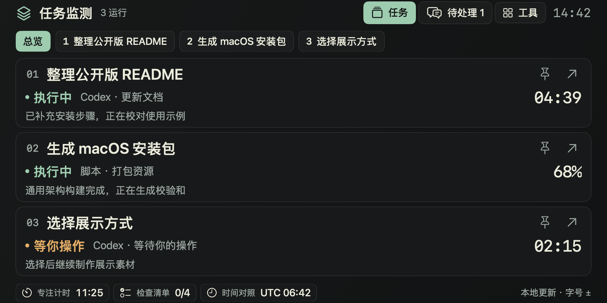
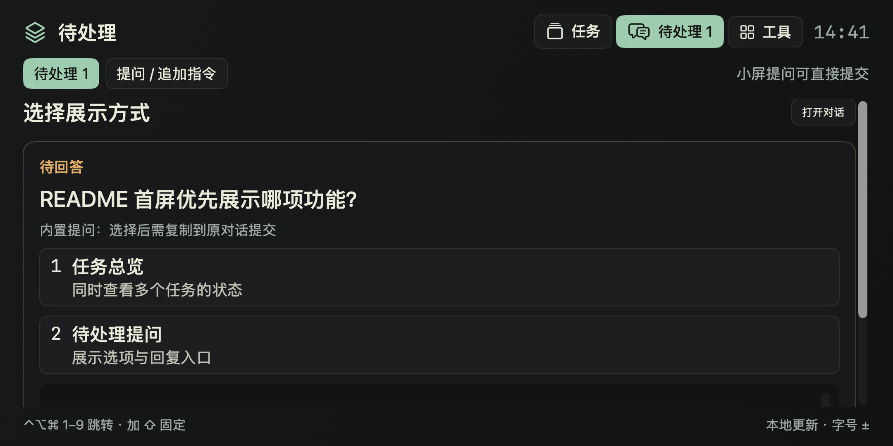
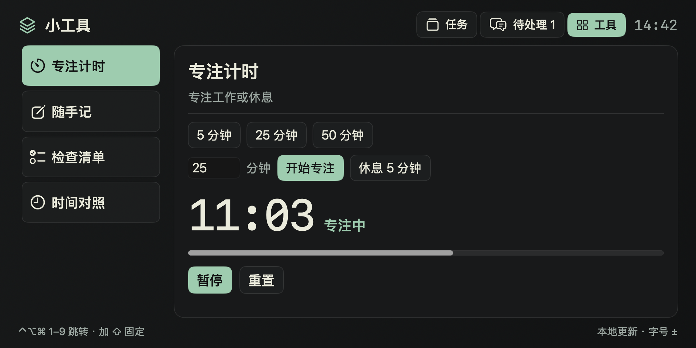

# Small Screen Status（小屏任务状态）

面向手机大小副屏的 macOS 原生状态窗口。它把 Codex 本地任务、脚本进度和需要处理的提问放在一处，并提供计时、笔记、清单等小工具。窗口按 macOS 给出的显示区域排版，不需要调整系统分辨率；默认选择面积最小的副屏，不显示 Dock 图标。

## 界面预览

下面是应用实际界面的截图，使用隔离预览模式和虚构任务生成，不含真实对话或设备信息。



| 待处理提问 | 小工具 · 专注计时 |
| :--- | :--- |
| [](assets/screenshots/questions.png) | [](assets/screenshots/tools.png) |

点击下方图片可查看原图。待处理截图演示的是 Codex 内置提问，回答需复制到原对话提交；通过 `$small-screen-ask` 发起的新问题可以直接在小屏提交。

## 获取与安装

从 [Releases](https://github.com/SoarChou/small-screen-status-public/releases) 下载 `SmallScreenStatus-*-macOS.zip`，解压后双击 `install.command`。安装程序将应用放到 `~/Applications/`，可设置随本机 ChatGPT/Codex 启动和退出；无需管理员权限。另有 `small-screen-install-*.zip`，可让 agent 使用随包附带的安装 skill。

要求 macOS 13+（Apple Silicon 或 Intel）和 Python 3.9+；默认使用 Apple Command Line Tools 提供的 `/usr/bin/python3`。分享包内已包含编译后的应用。应用使用临时签名，未经 Apple 公证；首次打开若被阻止，请按 [Apple 的说明](https://support.apple.com/102445) 在系统设置中确认。

详细步骤见 [安装说明](packaging/使用说明.md)。

## 主要功能

- **任务监测**：读取当前用户的 Codex 本地任务记录，显示侧栏任务标题、状态、最近公开进展和耗时；同时支持多个任务及脚本主动上报的百分比。
- **快速切换**：点击任务打开原对话；顶部任务条可固定监测 5 分钟。全局快捷键 `⌃⌥⌘ + 1–9` 跳转对应位置，`⌃⌥⌘⇧ + 1–9` 固定监测，`⌃⌥⌘ + 0` 返回总览。
- **提醒与提问**：任务完成、失败、计时结束和待处理提问会在小屏提示。已有 Codex 内置提问可复制回复并打开原对话；用 `$small-screen-ask` 新发起的问题可在小屏直接提交答案。正式权限审批仍在原应用处理。
- **本地工具**：专注计时、笔记、清单、时钟，以及可配置的本地读数和快捷入口。`⌃⌥⌘ + T` 切换任务、待处理和工具页。

更多交互和脚本上报示例见 [使用指南](docs/USAGE.md)，添加工具见 [扩展协议](docs/EXTENSIONS.md)。

## 从源码运行

需要 Xcode Command Line Tools（Swift 编译器和 Python）。在仓库根目录执行：

```sh
./scripts/build.sh
open 'build/Small Screen Status.app'
```

应用源代码在 `src/app/`，生命周期监听器在 `src/launcher/`，Python 监测与命令行工具在 `src/cli/`，默认工具配置在 `src/config/`。`packaging/` 是安装包模板和三个 agent skill；`scripts/` 负责构建与导出；`tests/` 包含自动验证。开发和发布命令见 [开发说明](docs/DEVELOPMENT.md)。仓库不跟踪 `build/` 或 `dist/` 产物。

## 数据与兼容性

应用在本机读取 `~/.codex/` 的任务元数据和事件，不修改 Codex 配置或完整对话。笔记、草稿、计时状态、脚本状态与运行日志保存在当前用户的应用支持目录；应用本身没有遥测或联网请求。具体数据范围和清理方式见 [隐私说明](docs/PRIVACY.md)。

Codex 本地记录格式不是稳定公开 API，未来版本可能需要适配。浏览器中的 ChatGPT 对话不提供本地任务记录，因此不会出现在任务列表。
